<p align="center">
  
</p>

# Airwave

**Turn your Plex library into your own always-on live TV.**

Airwave is a self-hostable service that builds curated, 24/7 **live TV channels** out of the media you already
own — a "90s Sitcoms" channel, a "Saturday Morning Cartoons" channel, a channel that quietly marathons your
favorite show — and streams them to a proper 10-foot TV app with a channel guide, a now/next lineup, and instant
tune-in. Think Pluto TV or an old cable box, but every channel is **yours**, running on **your** hardware, from
**your** library.

The whole system is free and open to self-host — run the server, point it at your media server, make channels.
It's yours to change and tinker with. The only paid thing is the *optional* convenience of the prebuilt
Apple TV / iPad apps on the App Store — and you're welcome to build and sideload those yourself, too.

> **Status:** actively developed, pre-1.0, and used daily on real hardware (LG webOS TV, Apple TV 4K, TrueNAS).
> See [Project status](#project-status) for what's solid vs. in progress.

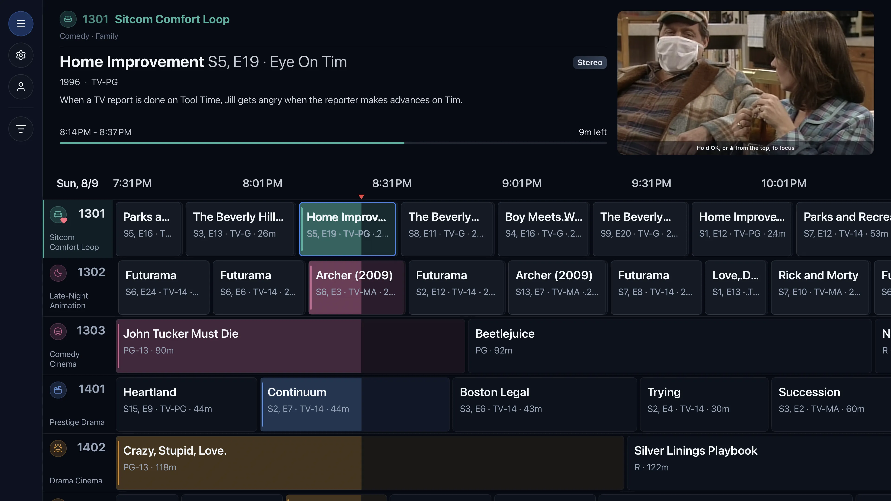

<sub>The Aurora channel guide, running on Apple TV. More in [Screenshots](#screenshots) below.</sub>

---

## Why I built this

I built Airwave for myself — to bring back the feeling of flipping on live cable TV as a kid, and to set up
channels of good content for my own kid to grow up with. I self-host it, I use it every day, and I plan to keep
maintaining it for many years.

It's yours to run and tinker with. The server, admin UI, and web/browser TV app are free and open — **change
whatever you want, that's encouraged.** You're welcome to modify the native TV apps and build/sideload your own
copies too, and **contributions and PRs are very welcome** — I'm happy to take improvements.

The one thing I ask — and the one thing the license draws a line around — is: **please don't repost my apps to the
app stores as your own.** The prebuilt, published Apple TV / iPad apps are a small paid download to hedge the time
and effort I've put in, for folks who just want to grab it and go. Everything else is free. (See [License](#license).)

## What it does

- **Channels from your library.** Define a channel by a **metadata filter** (genre, year, network, cast, rating,
  resolution, "added in the last 30 days", …), a **Plex collection**, a **Plex playlist**, or a hand-picked list
  of items. Airwave resolves it against your media server and keeps it up to date as your library grows.
- **A real, continuous schedule.** Every channel plays a deterministic, always-running lineup — like a broadcast
  station, not a shuffle button. Tune in and you join whatever's "on now," mid-program, with the correct offset;
  you can scrub back within the live buffer (DVR-style) but not skip ahead.
- **Channel strategies.** Go beyond plain shuffle or in-order: **group** by show and **rotate** across shows
  (round-robin), play **marathons**, size blocks by episode **count** or by **duration** ("~30 minutes of one
  show, then move on"), carve out a specific set (e.g. *Star Wars in release order*) with a filter, and enforce
  rules like *never repeat a show within an hour*. All deterministic and resumable.
- **Bumpers.** Optional between-program interstitials — a clean "Up Next" card with cover art — plus an optional
  **ambient music bed** you can point at a folder of tracks.
- **Per-user sharing.** Plex-style access control: give each user everything, a whole package of channels, or
  just specific channels. The admin UI is admin-only; everyone else just watches.
- **Capability-aware playback.** On first run each device measures **exactly what it can decode** (a short,
  automatic diagnostic), so Airwave direct-plays natively wherever possible and only transcodes when it must —
  4K HDR HEVC, TrueHD/DTS, the works, per device.
- **Watch from anywhere.** Off-network playback resolves the right connection to your media server
  automatically (local → remote → relay), so the same app works at home and on the road.
- **Move channels between instances.** Export a lineup (packages + channels + filters) and import it into another
  Airwave — with dry-run and de-duplication.
- **Optional AI channel builder.** *Off by default.* If you want, bring your own API key and let an assistant
  draft channel lineups from a prompt — but everything above works fully without it, and it never phones home
  otherwise. (See [AI features](#ai-features-optional).)

---

## How it works

Airwave is a small server plus thin clients. The server does the thinking; the clients just tune in.

1. **Resolve.** A channel's definition (filter / collection / playlist / manual list) is resolved against your
   media server into a pool of playable items, with metadata cached locally.
2. **Schedule.** A deterministic engine lays that pool onto a timeline — seeded, so the same channel always
   produces the same lineup — and materializes it ahead in **windows**, auto-extending as time moves forward. A
   cursor lets it resume exactly where it left off, so a channel is watchable within seconds of creation even for
   a 2,000-episode pool. Channel **strategies** (grouping, rotation, run-length, no-repeat rules) are just a
   smarter ordering over that pool, applied at one point in the engine — still deterministic.
3. **Tune in.** Clients ask "what's on channel N right now?", get the item + the exact offset ("effective time"),
   and start playing there. There's no server-side transcode queue for the schedule itself — playback streams
   from your media server, with the device's measured capabilities deciding direct-play vs. transcode.

**One image, a few roles.** The whole backend ships as a **single Docker image** whose behavior is chosen at
runtime by `CG_ROLE`:

- `server` — the API (REST + tRPC), scheduling engine, jobs, and Plex integration.
- `web` — the admin web app (build + serve).
- `tvweb` *(optional)* — the 10-foot TV app served as an auth-gated browser player, for casting/kiosk setups.

A Postgres database and [`docker-compose.yml`](./docker-compose.yml) wire it together.

---

## Screenshots

### On your TV (the 10-foot app)

|   |   |
|---|---|
|  | 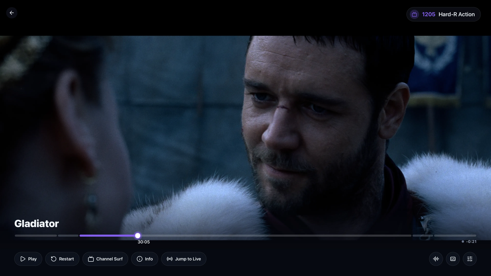 |
| *The Aurora channel guide — channels on the rail, what's on now/next.* | *A channel playing, with the DVR scrubber and glass controls.* |
| 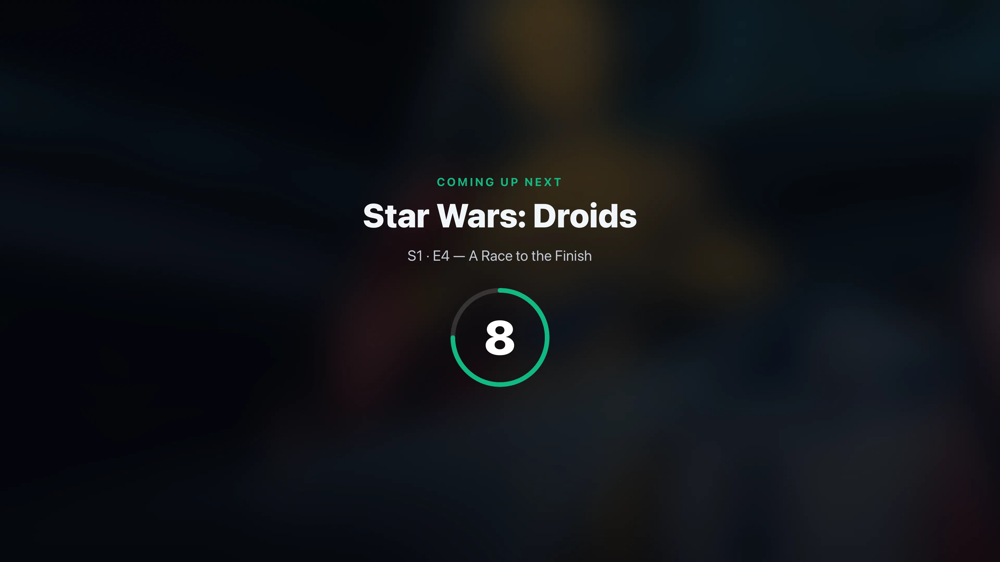 | 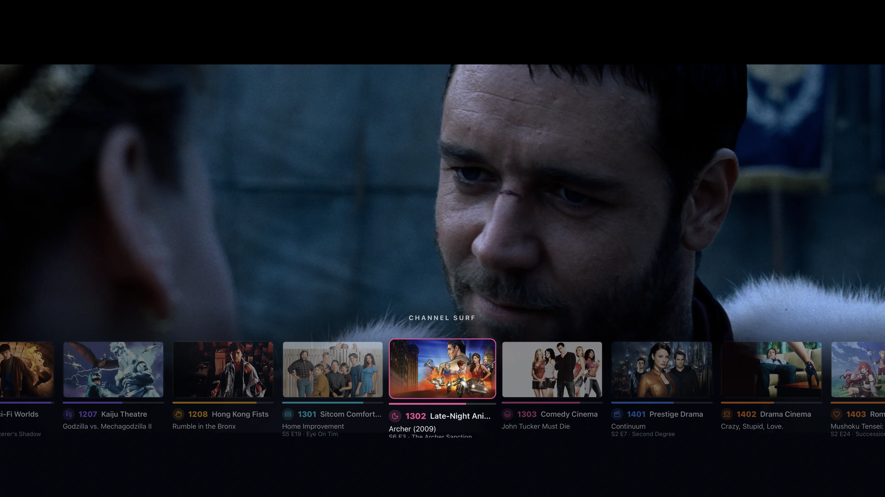 |
| *The "Up Next" bumper between programs (with an optional music bed).* | *Channel surf — flip channels without leaving what's on.* |
| 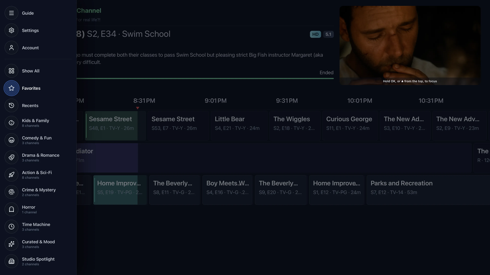 | 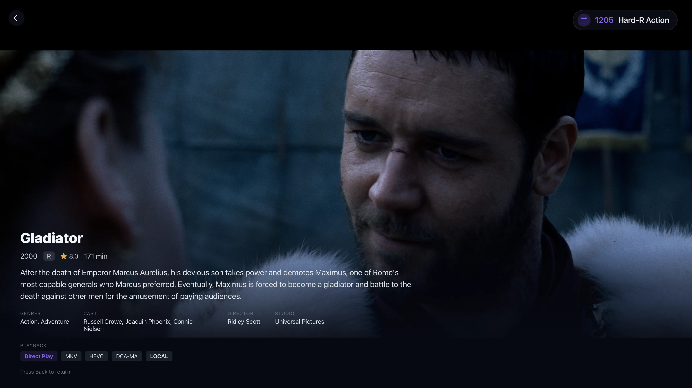 |
| *Filter the guide by package, favorites, or recents.* | *Full program info while you watch.* |

### In the admin (build & manage)

|   |   |
|---|---|
| 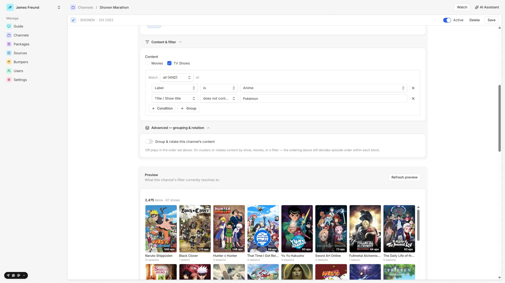 | 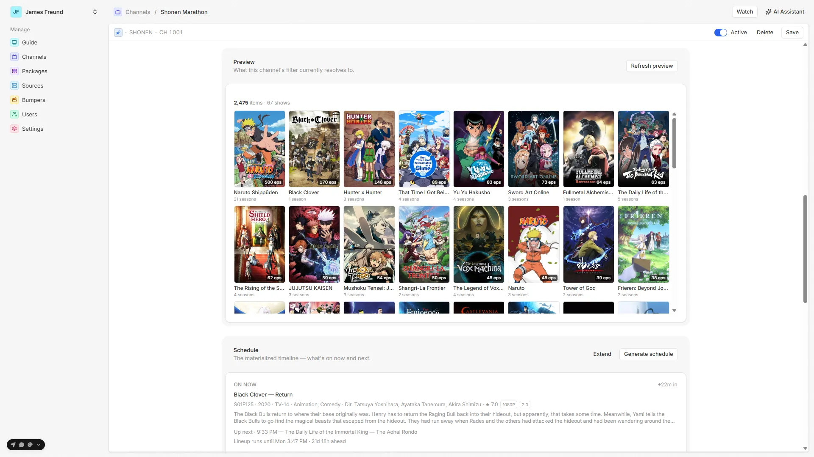 |
| *Build a channel from a metadata filter, with grouping & rotation strategies — and a live preview of what resolves.* | *Preview the resolved pool and the generated schedule.* |
| 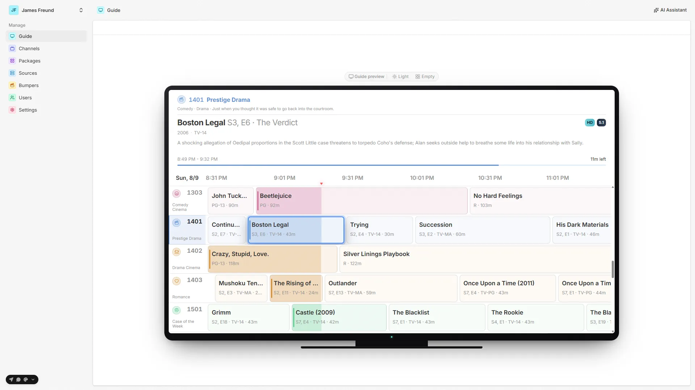 | 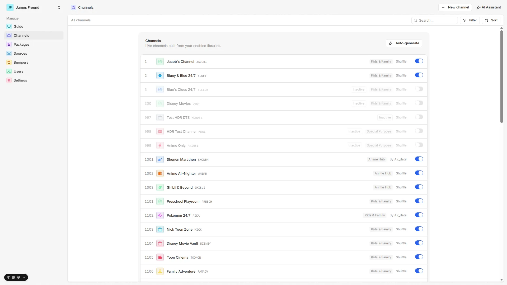 |
| *The guide, previewed in a TV-device mockup.* | *All your channels at a glance.* |
| 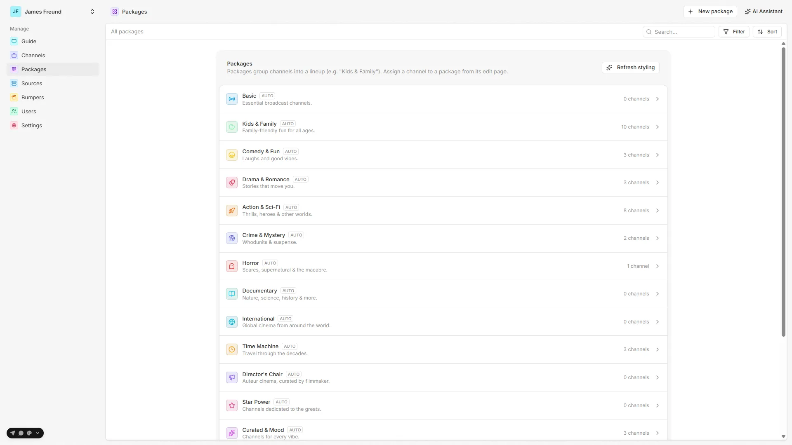 | 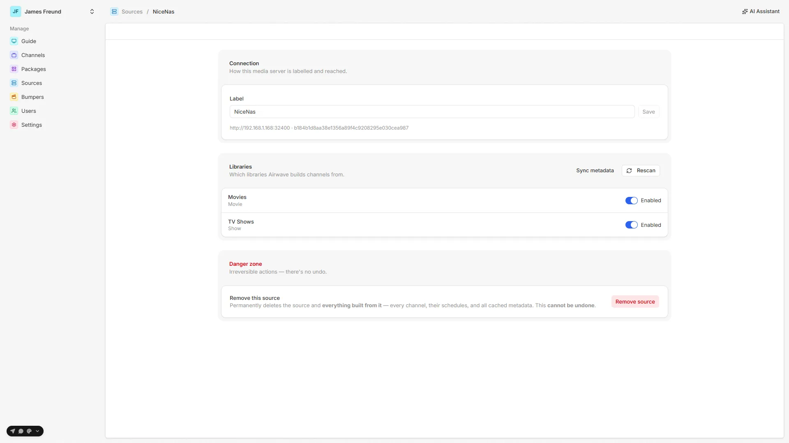 |
| *Group channels into packages.* | *Connect your Plex server and choose libraries.* |
| 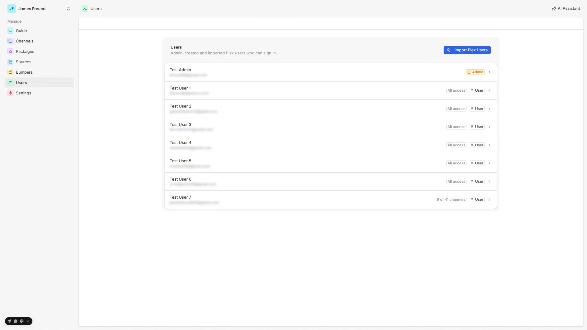 | 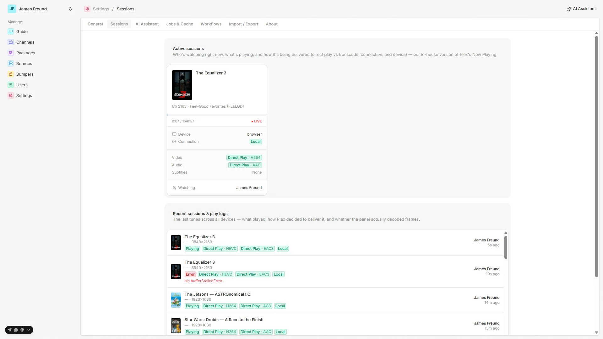 |
| *Plex-style per-user access control.* | *Now Playing — who's watching, and how each stream is delivered.* |
| 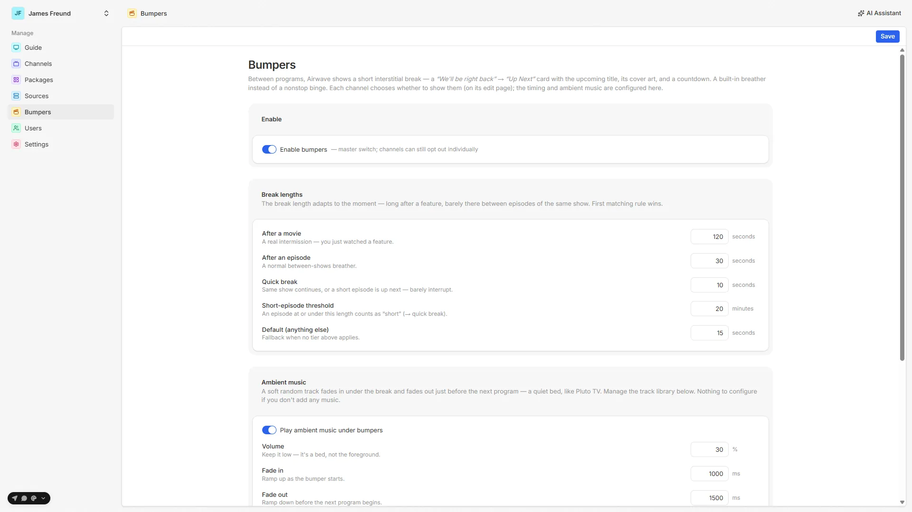 | 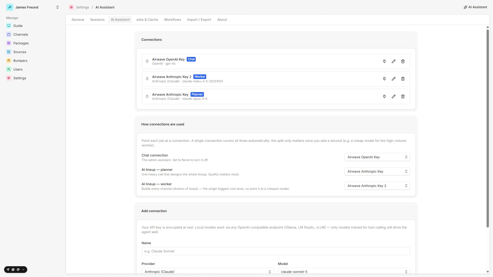 |
| *Bumpers + an optional ambient-music library.* | *Optional AI — bring your own provider key.* |
| 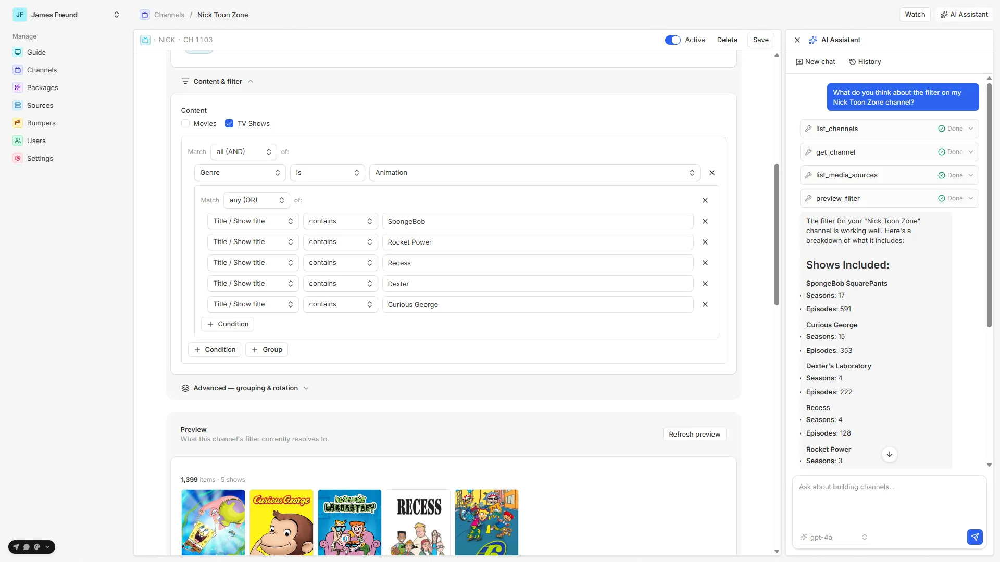 | 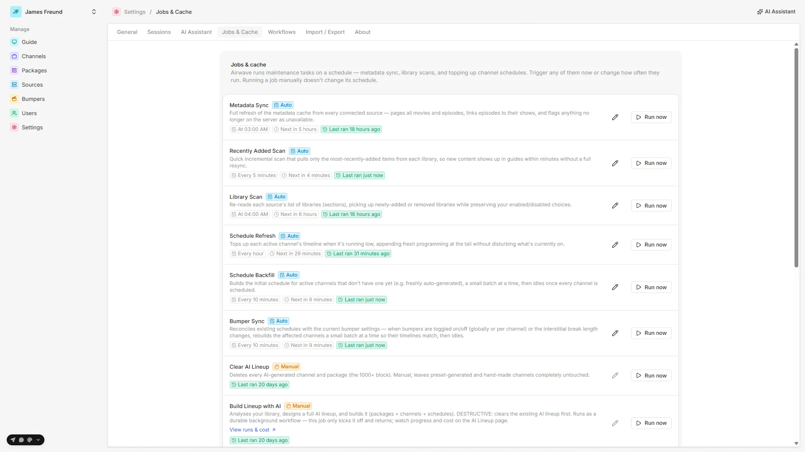 |
| *The AI assistant analyzing a channel's filter, with tool calls.* | *Background jobs — metadata sync, schedule refresh, and more.* |

---

## Clients

| Surface | Runs on | Notes |
|---|---|---|
| **Admin web** | any browser | create channels & packages, manage users/bumpers, run jobs, preview lineups |
| **TV app (native)** | Apple TV, iPad, Android TV, Fire TV | Expo / React Native + **mpv** for wide-codec native playback |
| **TV app (webOS)** | LG smart TVs | packaged `.ipk` (attached to each release) |
| **TV app (browser)** | any Chromium browser / kiosk | the `tvweb` role above |

The TV app is a full 10-foot experience: an Aurora channel-guide grid, a native-first player with a DVR
scrubber, channel up/down, and the "Up Next" bumper card.

---

## Requirements

- A **media server** — **Plex** today (Jellyfin/Emby support is on the roadmap).
- **Docker** + **PostgreSQL** (the compose file includes Postgres).
- Somewhere to run it — a NAS (TrueNAS is well-tested), a home server, a VPS, etc. Multi-arch images mean
  amd64 **and** arm64 (Raspberry Pi-class hardware) both work.

---

## Self-hosting (Docker)

### Quick start (Dockge or `docker compose`)

1. **Grab the stack files** — [`docker-compose.yml`](./docker-compose.yml) and [`.env.example`](./.env.example).
   In Dockge: create a stack, paste the compose, then the env.
2. **Copy `.env.example` → `.env`** and set at minimum:
   - `SERVER_PUBLIC_URL` / `WEB_PUBLIC_URL` — the addresses your **browser and TV** use (your host's LAN IP or a
     domain + the published ports), e.g. `http://192.168.1.50:36020` and `http://192.168.1.50:36021`. **Not**
     `localhost` unless you only browse from the host — these are baked into the admin build and used for
     auth/CORS.
   - `SERVER_PORT` / `WEB_PORT` — published host ports (must match the URLs above).
   - `POSTGRES_PASSWORD` and `BETTER_AUTH_SECRET` (`openssl rand -base64 48`).
   - `ADMIN_EMAIL` / `ADMIN_PASSWORD` — seeds the first admin on first boot.
   - `PUID` / `PGID` / `TZ` — match your host (important on TrueNAS datasets).
3. **Deploy:**
   ```bash
   docker compose up -d
   ```
   The `server` applies DB migrations (`prisma migrate deploy`) then starts. The `web` service builds the admin
   SPA against `SERVER_PUBLIC_URL` on first boot (takes a minute), then serves it.
4. **Open the admin** at `WEB_PUBLIC_URL`, sign in with the seeded admin, connect your Plex source, and run a
   metadata sync.
5. **Make a channel**, then **open the TV app** → it scans your LAN for the server (or enter `SERVER_PUBLIC_URL`
   manually) → sign in → watch.

### Image

Published to GHCR, multi-arch (amd64 + arm64): **`ghcr.io/quixomatic/airwave`**. Update with:

```bash
docker compose pull && docker compose up -d   # migrations apply automatically on start
```

### Build the image yourself

```bash
# stage the capability-probe clips (baked in for the TV diagnostic), then build:
gh release download media-v1 -p capability-media.tar.gz -D docker/cap-media
docker build -t airwave:local .
```
Set `CG_IMAGE=airwave:local` in your `.env` to run the local build.

---

## Development

Airwave is a **pnpm + Turborepo monorepo** on the [Better-T-Stack](https://github.com/AmanVarshney01/create-better-t-stack).

### Prerequisites

- [Bun](https://bun.sh) and [pnpm](https://pnpm.io), Node 22+
- A local PostgreSQL (or point at any Postgres via `apps/server/.env`)

### Setup

```bash
pnpm install
# configure apps/server/.env with your DATABASE_URL, then:
pnpm run db:migrate     # apply committed migrations
pnpm run dev            # start everything (server + admin web)
```

- Admin web → http://localhost:3001
- API → http://localhost:3000

> Schema changes go through **Prisma migrations** (`pnpm db:migrate` creates + applies one). `db:push` is for
> throwaway experiments only; Docker/production runs `prisma migrate deploy`.

### Project structure

```
airwave/
├── apps/
│   ├── server/      # API (Hono, tRPC + REST), scheduling engine, jobs, Plex integration
│   ├── web/         # Admin web app (React + TanStack Router)
│   ├── tv-web/      # 10-foot TV app for webOS + browser (Vite)
│   └── tv-native/   # Native TV app (Expo/React Native): Apple TV, iPad, Android TV, Fire TV
└── packages/
    ├── api/         # Business logic / services (scheduling, plex, bumpers, access, …)
    ├── auth/        # Better-Auth config (Plex OAuth + roles, device-code login)
    ├── db/          # Prisma schema, migrations, generated client
    ├── ui/          # Shared shadcn/ui primitives + design tokens (used by web apps)
    ├── env/         # Typed environment loading
    ├── config/      # Shared TS/build config
    ├── mpv-player/  # Native mpv player module (video + headless audio) for tv-native
    └── key-input/   # Native remote/hardware-key input module for tv-native
```

### Handy scripts

| Script | Does |
|---|---|
| `pnpm dev` | start all apps in dev |
| `pnpm dev:server` / `pnpm dev:web` | start just one |
| `pnpm build` | build all apps |
| `pnpm check-types` | typecheck across the monorepo |
| `pnpm db:migrate` / `db:studio` / `db:generate` | Prisma migrate / studio / client |

The web apps share shadcn/ui primitives via `@airwave/ui` — edit tokens in `packages/ui/src/styles/globals.css`,
primitives in `packages/ui/src/components/*`. Import them with `import { Button } from "@airwave/ui/components/button"`.

---

## Tech stack

- **Runtime/server:** Bun, [Hono](https://hono.dev), tRPC + REST
- **Data:** PostgreSQL + [Prisma](https://www.prisma.io)
- **Auth:** [Better-Auth](https://www.better-auth.com) (Plex OAuth + roles, TV device-code login)
- **Web:** React, TanStack Router/Query, TailwindCSS, shadcn/ui
- **Native TV:** Expo / React Native (react-native-tvos) with an **mpv** playback engine
- **Monorepo:** pnpm workspaces + Turborepo

---

## Project status

Built and proven in real use:

- Plex integration, filter/collection/playlist/manual channel definitions
- Deterministic continuous scheduling with windowed builds + resume
- Channel strategies (grouping, rotation, count/duration runs, no-repeat, marathons)
- Bumpers (interstitials + optional ambient music library)
- Per-user access control + admin-only admin UI
- Capability diagnostic + native-first playback (mpv); off-network local/remote/relay
- Lineup import/export between instances
- Native apps running on iPad, Apple TV 4K, Android TV, Fire TV, and LG webOS; self-host on TrueNAS

On the roadmap / in progress:

- Rotation **weighting + freshness** (make a show air more/less often; surface just-added episodes)
- **Jellyfin / Emby** media-server support
- A manual schedule editor, more platforms, and general pre-1.0 polish

---

## AI features (optional)

Airwave has an **optional** AI assistant for authoring channels — and it's genuinely optional: none of the core
product (channels, scheduling, playback, apps) depends on it, and **nothing is sent to any AI provider unless you
set one up**.

- **The assistant/chat** activates only when an admin adds an **AI connection** in the admin — *your* provider
  and *your* API key (Anthropic, OpenAI, Google, or any OpenAI-compatible endpoint). No connection → no
  assistant, and no external calls.
- The heavier **durable workflows** — the multi-agent AI *lineup generator* and the *lineup import/export*
  engine — additionally require `WORKFLOW_ENABLED=1` (off by default). This flag gates the workflow engine
  itself, not the chat.

Bring-your-own-key, opt-in, and fully separable — a convenience for authoring, not a dependency.

---

## License

Airwave is **source-available** under the [PolyForm Perimeter License 1.0.1](./LICENSE). In plain terms: use it,
self-host it, change it, and build your own copies freely — for **any purpose except providing a product that
competes with Airwave** (which includes republishing/reselling the apps or offering a competing hosted service).

| ✅ You can | ❌ You can't |
|---|---|
| Self-host the whole thing (server, admin, web/browser TV) — free | Repost/republish the apps to an app store (Apple / Google / LG) |
| Read, modify, and change **any** part — encouraged | Sell it, or offer it as a paid product/download |
| Build & sideload your own apps, with your own tweaks | Offer a hosted service that substitutes for Airwave |
| Use it for any purpose — personal, family, or business self-host | Remove the copyright / required-notice line |
| Open pull requests — contributions are welcome | — |

As the copyright holder, I publish the official prebuilt apps myself (a small paid convenience on the App Store).
This isn't legal advice — the [LICENSE](./LICENSE) is the authoritative text.

---

## Acknowledgements

Inspired by the self-hosted "make your own live TV" community (NostalgeX / BunnyEars and friends), built on
[Better-T-Stack](https://github.com/AmanVarshney01/create-better-t-stack).
</content>
