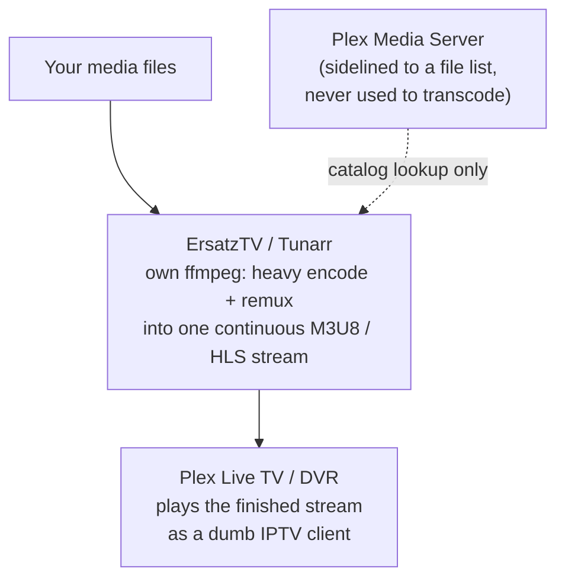
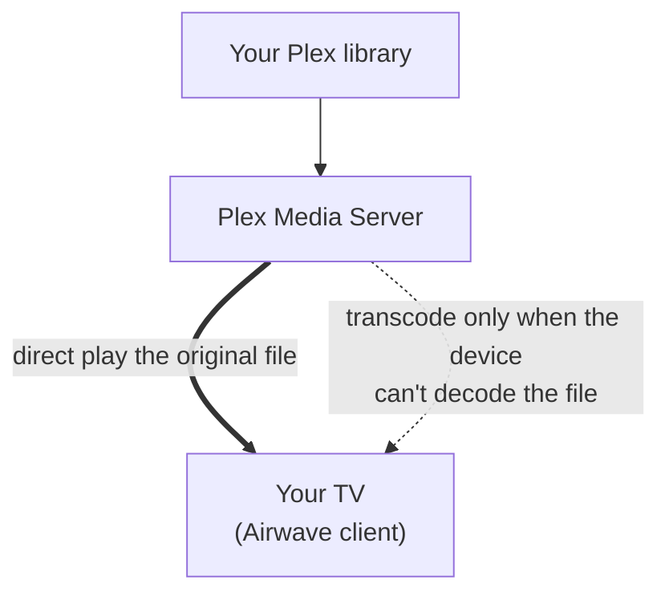

If you self-host Plex, you already own a really good piece of software for one specific job: taking a file off your disk and getting it onto your screen. When your device can play the file as-is, Plex hands it over untouched. That's direct play. When your device can't, Plex transcodes, but only then, and only as much as it has to. Deciding which of those to do, per device and per file, is basically the whole point of a media server.

The part that bugs me about most self-hosted live TV is that it throws all of that away.

## How the IPTV-style tools work

ErsatzTV and Tunarr are the usual names when someone wants "live channels from my own library," and they're clever tools. But look at what they actually do. They take your media, arrange it into a schedule, and then produce a single continuous stream: an M3U/HLS feed you point an IPTV client (or Plex's own DVR, or Jellyfin live TV) at.

The catch is in the word *continuous*. To make a hundred different files, with different codecs, resolutions, and audio layouts, play back to back as one seamless channel, something has to normalize them into one uniform stream. That something is their own copy of ffmpeg, running on your server, remuxing and transcoding as it goes. So your machine is re-encoding your library to build the channel, even for files your TV could have played without touching a single frame.

And notice where Plex ended up in that picture. If you're using it at all, it has been demoted to a file list. The transcode-decision engine, the direct-play smarts, the part a media server is actually built for, sits idle while a second tool re-encodes everything anyway.

## What Airwave does instead

Airwave doesn't build a stream. There is no channel feed to point a player at.

Instead, the native Airwave app on your TV asks your Airwave server one question: what's on this channel right now? The server answers with the actual program and where you are in it, the app opens the real Plex file and plays it directly, seeking to the right spot, and when the program ends it moves to the next file. A program boundary is just the app opening the next thing.

Because it's playing the real file, your 4K HDR HEVC stays 4K HDR HEVC. Nothing is re-encoded to fit a stream. And it uses Plex the way Plex is meant to be used: it asks the server for the media, direct-plays whatever your device can decode, and falls back to the Plex transcoder only when a device genuinely can't play something. On a modern Apple TV or Fire TV, that fallback rarely needs to fire.

I spent a while making sure of that. The first time an Airwave app talks to your server it measures what the device can really decode, the container, the video codec, and the audio codec. So the direct-play decision is based on what your hardware actually does, not what it claims.

## Why it matters

A few things fall out of this.

Your files keep their quality. There's no generation loss from re-encoding a channel stream, because there is no channel stream to encode into.

Your server stops working so hard. No ffmpeg process pinned all day building feeds. The heavy lifting only happens for the occasional file a device can't handle on its own.

And you get real apps. Because Airwave isn't an IPTV feed, it can be a proper 10-foot app on Apple TV, Fire TV, Android TV, Roku, webOS, Samsung, the browser, and Windows, macOS, and Linux, with a real channel guide, DVR seeking, and channel surfing, instead of whatever your IPTV player happens to render.

## To be fair to the other tools

ErsatzTV and Tunarr aren't doing it wrong. A standard IPTV feed is the entire point of them: it works without Plex, and any player that speaks M3U can consume it. If that's what you want, they are the right call, and they have earned their reputation.

Airwave made the opposite trade. It needs its own app on each platform, and building those was most of the work. In return, it direct-plays your library at full quality, leans on the server you already run instead of a second transcoder, and behaves like actual television rather than a stream you tune a generic app into.

That trade is the reason Airwave exists. If you already run Plex, it turns out the server can just play your files. It would be a shame to spend your CPU re-encoding them instead.

<Cta
  title="Ready to save your CPU cycles?"
  subtitle="Airwave is completely free and self-hosted, and every channel is yours to build. Point it at your Plex library and start surfing."
/>
