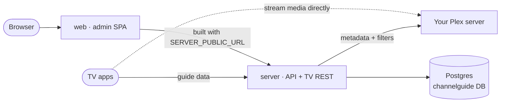

import { Cards, Card } from "fumadocs-ui/components/card";

Airwave is built to be **self-hosted**: you run the server next to your media, point it at a Plex
library, and stream your own channels to the TV apps. There's nothing to sign up for and no hosted
tier.

**Two ways to run it — same server, pick what fits your setup:**

- **Docker (recommended)** — for a NAS, mini-PC, or always-on Linux box. A single prebuilt image plus a
  Postgres database, wired by `docker compose`. No antivirus false positives, and the easiest to keep
  updated. This section walks that path in detail below.
- **[One-click desktop app](/docs/self-hosting/desktop)** — for running Plex on your own Windows, macOS, or
  Linux machine. An installer + a tray app with **embedded Postgres**; no Docker, nothing to configure to
  start. The signed installers are still new, so some antivirus / SmartScreen tools may flag them; if yours
  does, use Docker instead.

## Fastest start: the one-line installer

On any machine with Docker, one command checks Docker, asks a few questions (with sensible defaults, including
auto-detecting your LAN IP), writes the stack, and brings it up.

Linux, macOS, or Windows via WSL / Git Bash (any POSIX shell):

```bash
curl -fsSL https://www.getairwave.tv/install.sh | sh
```

Windows native (Docker Desktop, in PowerShell):

```powershell
irm https://www.getairwave.tv/install.ps1 | iex
```

Both take the same options:

- **Pin a version:** `... | sh -s -- --version 0.14.13` (or `-Version 0.14.13` on PowerShell). Latest by default.
- **Preview only:** add `--dry-run` (`-DryRun`) to see everything it would do without writing or starting anything.
- **Update:** re-run the same command (or `docker compose pull && docker compose up -d` in the stack dir).
- **Uninstall:** add `--uninstall` (`-Uninstall`) — keeps your data; add `--purge` (`-Purge`) to delete the
  volumes and directory too.

The shell script uses [`gum`](https://github.com/charmbracelet/gum) for the prompts (downloaded to a temp dir
and checksum-verified if you don't already have it, with a plain-text fallback). On native Windows the
PowerShell script detects your LAN IP most reliably; under WSL the `curl | sh` line works just as well. Both are
small and auditable — read them first at [getairwave.tv/install.sh](https://www.getairwave.tv/install.sh) or
[/install.ps1](https://www.getairwave.tv/install.ps1) if you prefer. Rather wire it up by hand? The manual
`docker compose` steps below do exactly the same thing.

## The deploy model

Everything ships as **one image, run several ways**. The published container
(`ghcr.io/quixomatic/airwave`) is a single artifact; which app it becomes is chosen at runtime by the
`CG_ROLE` environment variable:

- **`server`** — the Bun API + the TV REST surface. Applies database migrations on start, then serves
  the API that the admin panel and every TV client talk to.
- **`web`** — the admin panel (a Vite SPA). Because each self-host lives at a different address, the
  SPA is **built at container start** with your `SERVER_PUBLIC_URL` baked in, then served.
- **`tvweb`** *(optional)* — the 10-foot TV app served as an auth-gated **browser** web player. Off by
  default; enable it with a compose profile.

A typical stack is therefore three services from two images: **Postgres**, the **server**, and the
**web** admin — all wired together by `docker-compose.yml` and a single `.env`. See
[Roles & the single image](/docs/self-hosting/roles) for why it's built this way.



## Prerequisites

- **A host that runs Docker** — a NAS (TrueNAS SCALE is proven), a mini-PC, or any Linux box with
  `docker compose` (or a UI like Dockge / Portainer). The image is **multi-arch** (amd64 + arm64).
- **A LAN address or domain** for the host. The admin and TV apps reach the server over the network,
  so you need an address that your **browser and TV** can actually use — a LAN IP or a domain, **not**
  `localhost` (unless you only ever browse from the host itself).
- **A Plex server** whose library you want to turn into channels, reachable from the Airwave server
  (same LAN is simplest). Plex is the only media server supported today.

## In this section

<Cards>
  <Card title="Docker quick start" href="/docs/self-hosting/docker" description="Grab the stack files, fill in .env, bring it up — first boot, admin seed, and reaching the panel." />
  <Card title="Desktop app" href="/docs/self-hosting/desktop" description="Run the whole server on your Windows/Mac/Linux machine next to Plex — an installer + tray app, embedded Postgres, no Docker." />
  <Card title="Configuration" href="/docs/self-hosting/configuration" description="The full .env reference — every variable, what it does, defaults, and which are required." />
  <Card title="Roles & the single image" href="/docs/self-hosting/roles" description="One image, N roles (CG_ROLE) — the server, the admin web, and the optional browser TV player." />
  <Card title="Updating" href="/docs/self-hosting/updating" description="The release loop — pull a new tag, restart, migrations apply themselves; how images reach GHCR." />
</Cards>

## Once it's up

Deploying gets you a **running server and an admin login** — that's the starting point for the rest of
the docs. From the admin panel you connect a source, build channels, and add viewers:

- [Quick Start](/docs/getting-started) — zero to watching, end to end.
- [Sources](/docs/sources) — connect and sync your Plex library.
- [Settings](/docs/settings) — jobs, sessions, AI, and import/export.

## Source map

| Concern | File |
|---|---|
| Compose stack (postgres + server + web + optional tvweb) | `docker-compose.yml` |
| Environment reference (copy to `.env`) | `.env.example` |
| Image build (one image, roles via `CG_ROLE`) | `Dockerfile` |
| Container entrypoint (PUID/PGID remap, migrations, role dispatch) | `docker/entrypoint.sh` |
| GHCR publish / release workflow (on a `v*` tag) | `.github/workflows/docker-publish.yml` |
| First-admin seed (from `ADMIN_EMAIL` / `ADMIN_PASSWORD`) | `packages/auth/src/lib/seed-admin.ts` |
| Server env schema (validated at boot) | `packages/env/src/server.ts` |

---

See also: [Quick Start](/docs/getting-started) · [Sources](/docs/sources) ·
[Settings](/docs/settings)
